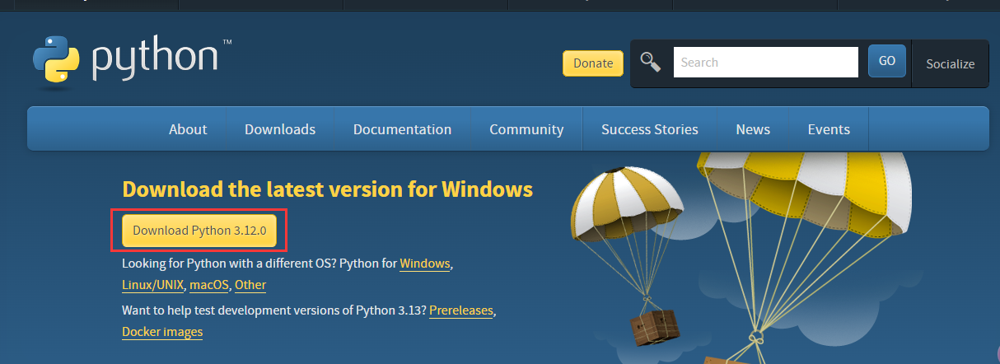
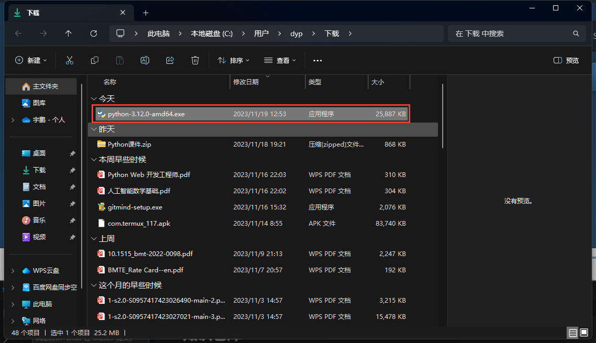
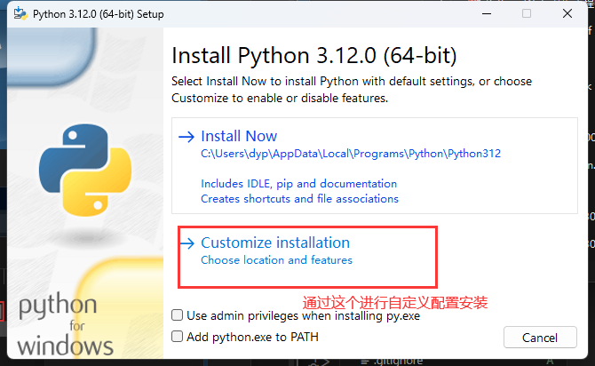
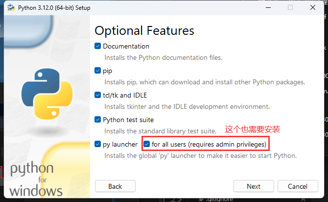
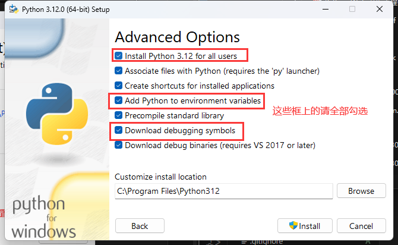
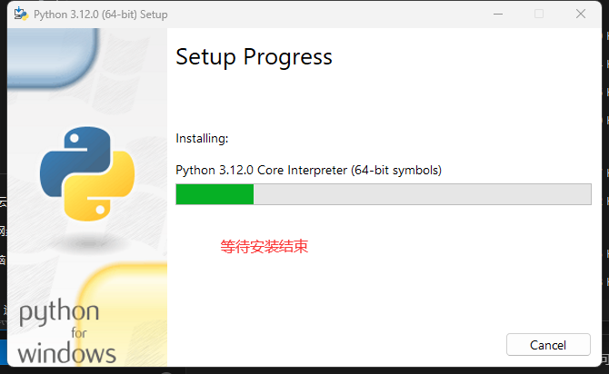
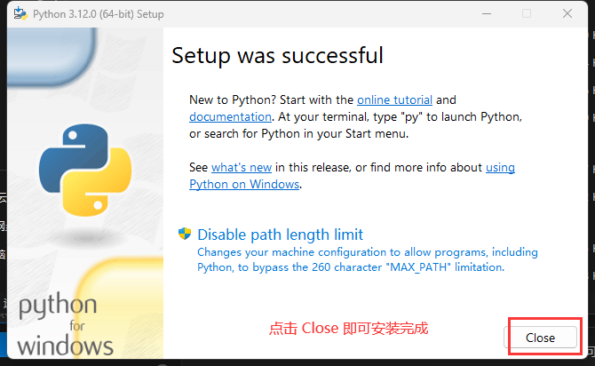

# Python 介绍与环境安装
id:: 655992e7-da7c-4d67-a546-eadd49b28b02
	- Python 是一门强类型的 **解释型** 脚本语言。它的运行需要一个称为 **解释器** 的程序作为支持。下面我们就来安装这个解释器
	-
	- ## Windows 安装
		- 在Windows上安装方法由多种，我们这里介绍两种
		- ### 官网下载安装包
		  collapsed:: true
			- 首先到 [Python官网](https://www.python.org/downloads/) 进行下载安装
				- 
			- 双击打开，即可进行安装
				- 
				- 
				- 
				- 
				- 
				- 
			-
		- ### scoop 包管理安装
		  collapsed:: true
			- 这里我们首先需要安装 [scoop](https://scoop.sh/) 包管理器
				- 下载 scoop 安装脚本
					- ```shell
					  irm get.scoop.sh -outfile 'install.ps1'
					  ```
				- 安装 scoop
					- ```shell
					  .\install.ps1 -ScoopDir 'D:\Applications\Scoop' -ScoopGlobalDir 'F:\GlobalScoopApps' -NoProxy
					  ```
			- 安装 Python
				- ```shell
				  scoop update --all
				  scoop install python
				  ```
	- ## Linux 安装
		- 根据不同的发行版使用不同的安装命令进行。例如 Archlinux 使用
			- ```shell
			  pacman -S python python-pip
			  ```
		- 其余的自行查看
	- ## Mac OS 安装
		- 参照官网
	- # 编辑器
		- 我们可选择使用 [vscode](https://code.visualstudio.com/) 作为编辑器
		- 当然还可以选择 [Pycharm](https://www.jetbrains.com/pycharm/) 作为编辑器
	-
- #
-